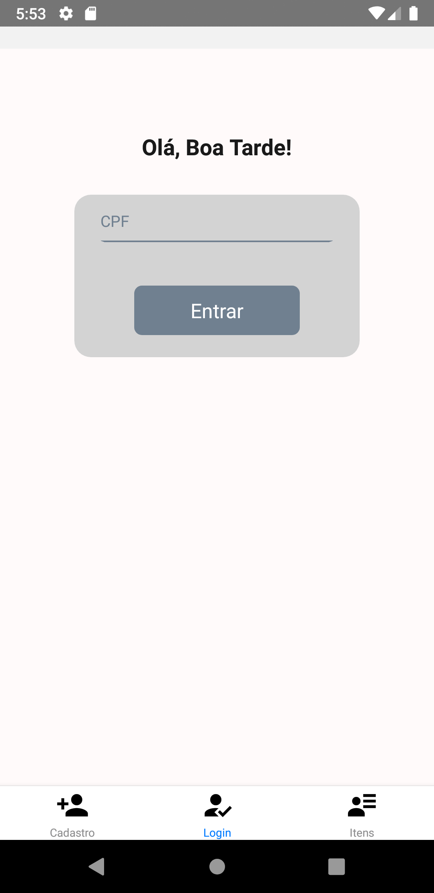

## **TESTE PARA DESENVOLVEDOR (2)**

**Detalhamento do desafio**

Foi elaborado um App em React Native com desenvolvimento Android, na qual apresenta 3 telas:

-Cadastro;
-Login;
-Itens.

Na lista de itens, foi disponibilizado 5 livros contendo o Título, descrição e imagem.

... Espero que gostem!

**Informações Iniciais:**

Para submeter o seu projeto, **faça um fork** deste repositório e realize um **pull request** para enviar o seu código;

**Questão:**

Elaborar uma aplicação com React ou React Native (Android ou IOS) que atenda aos seguintes requisitos:

- apresentar um menu inferior para navegação;
- apresentar uma tela de login;
- apresentar uma tela de cadastro com os campos: nome, email e CPF;
- disponibilizar uma lista de itens com nome, descrição e foto.

Ps.: não precisa interagir com API para listar ou cadastrar informações, de maneira que as informações que serão apresentadas em tela podem ser definidas na própria aplicação.

...Boa Sorte!
